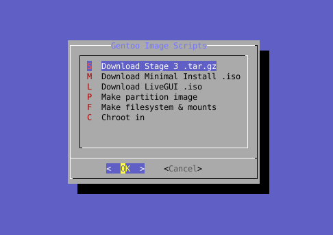
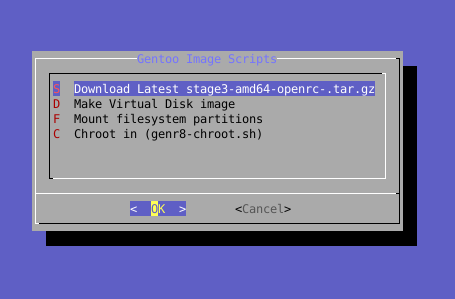
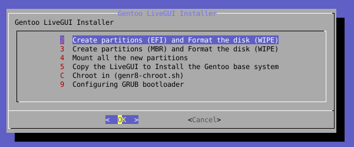

# The best gentoo creation document!
##### by genr8eofl @gentoo IRC - 2023+2024+2025 LICENSE - Creative Commons 4.0, Attribution

## Gentoo Image Scripts - start-dialog.sh , livegui-installer/install-dialog.sh

v1 = start-dialog.sh
v2 = amazing-pet-gentoo-dialog.sh
v3 = livegui-installer/install-dialog.sh
(relies on "dialog" CLI program to make user friendly menu of image creation)

### installer for livegui, or build from stage3s, chroots, disk images, partitions, VMs, and more! in depth guide

#### LiveGUI Installer (livegui-installer/install-dialog.sh):
2. - Create Partitions (EFI) and Format the disk (WIPE)
3. - Create Partitions (MBR) and Format the disk (WIPE)
4. - Mount all the new partitions
5. - Copy the LiveGUI to Install a complete Gentoo system
6. - Chroot in (genr8-chroot.sh)
9. - Configuring GRUB Bootloader


#### Stage3 (start-dialog.sh):
1. Start with a suitable __Stage3__ download, or make your own
2. __make amazing partition image__ create partitions & fs (truncate sparse, losetup, sfdisk, mkfs)
	[amazing-make-partition-truncate.sh](amazing-make-partition-truncate.sh)
3. __mount amazing partition image__ (mount /dev/loop0 /mnt/stage3_1)
	[amazing-mount-fs-partitions.sh](amazing-mount-fs-partitions.sh)
4. __extract Stage3__ into /mnt/stage3_1 (tar xvf * --...)
	[extract-stage3-all.sh](extract-stage3-all.sh)
5. use my genr8-chroot.sh script to __chroot into__ target /mnt/stage3_1
	[genr8-chroot.sh](genr8-chroot.sh)  (equiv of arch-chroot by me, genr8)

   (it binds /etc/resolv.conf, DISTDIR=/var/cache/distfiles, PORTDIR=/var/db/repos/gentoo)
6. __Configure__ Further. Hostname, timezone, locale, users, passwd etc.
7. Exiting genr8-chroot.sh with Ctrl^D should cause __auto-unmount__ of target /mnt/stage3_1
8. losetup -D to unmount .dd loop image. __Saved .dd Image__ is Finished!

###### DD Image Contains an entire gentoo disk at this point, and what you do with it is up to your creativity! 
Some ideas, boot it as a VM, make it read only and immutable, use it as a backup recovery partition, 
make multiple of them for many different software variants contained per image file. VM+Containerlike but manual.


### Stage3 explanation - very basic steps [basic-idea.txt](basic-idea.txt)
* Downloads a gentoo stage3.
* Makes the disk & partition setup & formats the partitions, (EFI,Boot,SystemRoot)
* Mounts the partitions.
* Chroot in (you will want to set up gentoo, emerge, kernel, bootloader, other config, etc.)
* Disk Image .dd file is finalized once everything is unmounted and loop detached


### amazing-pet-gentoo.sh (example) :
[Example Output - Full Process.txt](amazing-pet-gentoo-output-text.md) *click*
```
STAGE3="${1:-stage3-amd64-hardened-nomultilib-selinux-openrc}"                                                                                        
NUM=1                                                                                                                                                 
download-gentoo-iso-latest-dl_Spawns.sh "${STAGE3}"                                                                                                   
echo                                                                                                                                                  
echo "********************1****************************"                                                                                              
echo                                                                                                                                                  
amazing-make-partition-truncate.sh "${STAGE3}_${NUM}.dd"                                                                                              
echo                                                                                                                                                  
echo "********************2****************************"                                                                                              
echo                                                                                                                                                  
amazing-mount-fs-partitions.sh "${STAGE3}_${NUM}.dd"                                                                                                  
echo                                                                                                                                                  
echo "********************3****************************"                                                                                              
echo                                                                                                                                                  
echo "                 Go ! Chroot in:"                                                                                                               
echo "    genr8-chroot.sh /mnt/${STAGE3}_${NUM}"                                                                                                         
genr8-chroot.sh /mnt/"${STAGE3}_${NUM}"                                                                                                                  
echo "Unmounting. Loop device & Disk image remain."  
```
